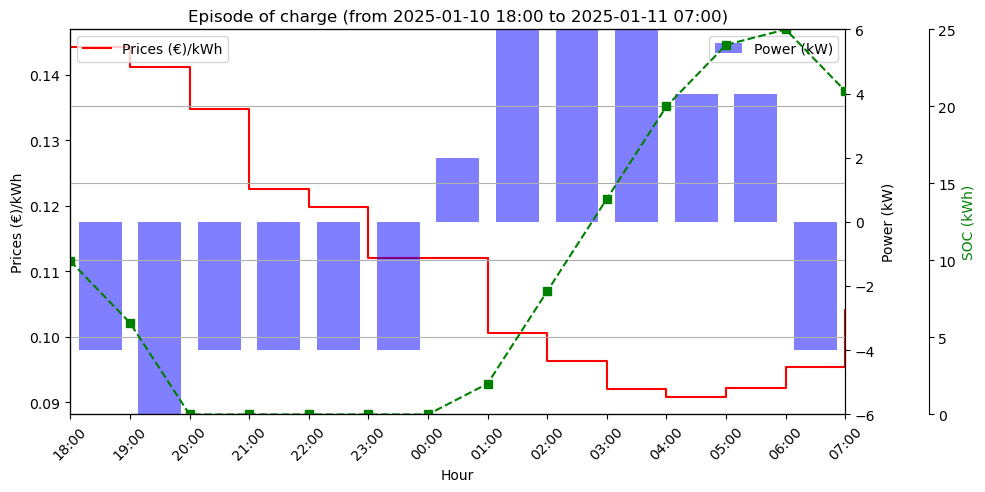

# DQN Electricity Price Agent

[](https://www.python.org/downloads/)
[](https://pytorch.org/)

A Reinforcement Learning implementation using a Deep Q-Network (DQN) to optimize an electric vehicle charging schedule based on historical electricity price data.

## 📖 Research Foundation
This project is an implementation of the methodology proposed in the following research paper:

> **"Model-free real-time EV charging scheduling based on deep reinforcement learning"** > *Authors: Wan, Z., Li, H., He, H., & Prokhorov, D.* > Published in: **IEEE Transactions on Smart Grid** (2018)

### Implementation Notes
While following the core architecture of the paper, this implementation introduces:
* **Custom dataset**: Utilizes EPEX Spot (France) hourly day-ahead prices from 2020 to 2025, downloaded from the ENTSO-e transparency platform.
* **Model's architecture**: On top of the SoC feature concatenated with the LSTM network output, we introduce the current price, and the hour of the day (both normalized).
* **Hyperparameters**: Hyperparameters are optimized for local execution. The architecture is scaled to allow full convergence on a standard laptop GPU/CPU within a reasonable timeframe. 


## Project Structure
```text
.
├── data/               # CSV datasets (ignored by git)
├── assets/             # Figures
├── models/             # Saved weights and normalization constants
├── notebooks/          # Contains a demo notebook
├── src/
│   ├── agent.py        # DQNAgent logic
│   ├── model.py        # Neural Network (extraction network + fully connected layers)
│   ├── environment.py  # Custom Environment
│   ├── config.py       # Constants
│   └── utils.py        # Preprocessing helpers
├── main.py             # CLI Entry point
├── requirements.txt    # Project dependencies
└── .gitignore          # Git exclusion rules
```


## Results

### Showcase
In the demo notebook we showcase the agent on specific dates in 2025, used only for test.
Here is an example of the prediction in 2025-01-10.



### Benchmarking

The agent was evaluated over 364 test episodes in 2025, against a Naive Agent (which charges at maximum power immediately upon arrival until full).
We can see that the proposed method reduces by 79% the charging cost while maintaining the final state of charge relatively close to a 100%.

| Metric | Naive Agent | DQN Agent |
| :--- | :---: | :---: |
| **Avg. Charging Cost** | 0.99 € ± 0.64 | 0.21 € ± 0.59 |
| **Avg. Final SoC** | 100.0 % ± 0.0 | 98.7 % ± 5.2 |
| **Cost Reduction** | - | ~78.8% |


## References
Wan, Z., Li, H., He, H., & Prokhorov, D. (2018). Model-free real-time EV charging scheduling based on deep reinforcement learning. IEEE Transactions on Smart Grid, 10(5), 5246-5257.

## License
This project is licensed under the MIT License - see the [LICENSE](LICENSE) file for details.